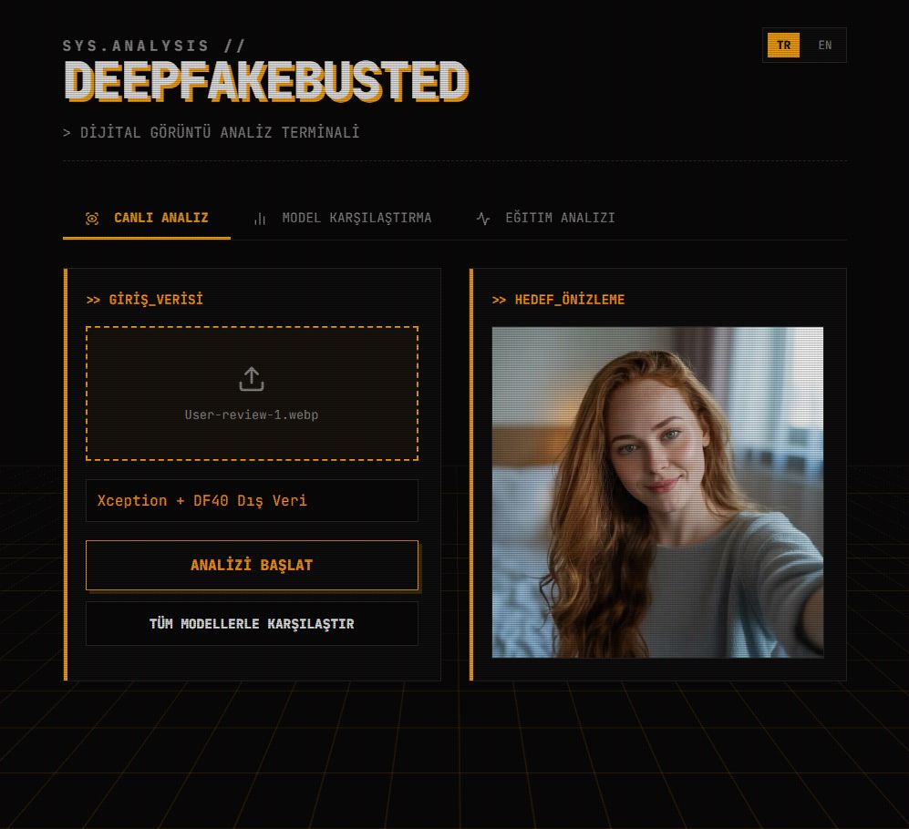
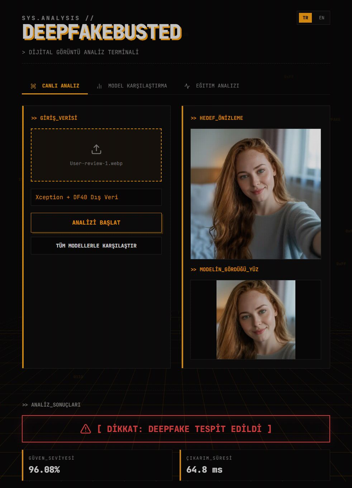
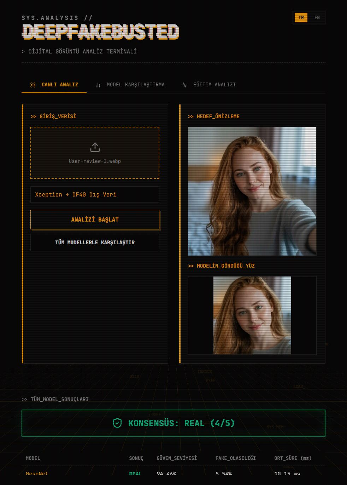
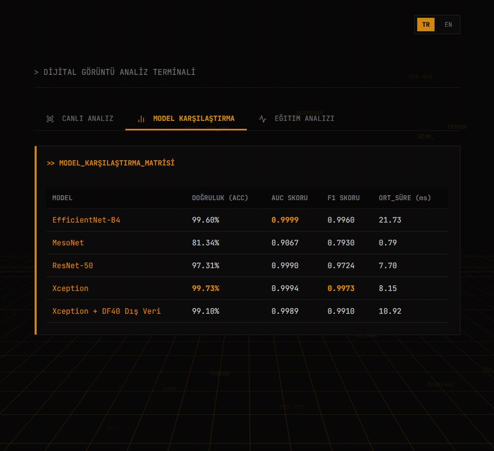
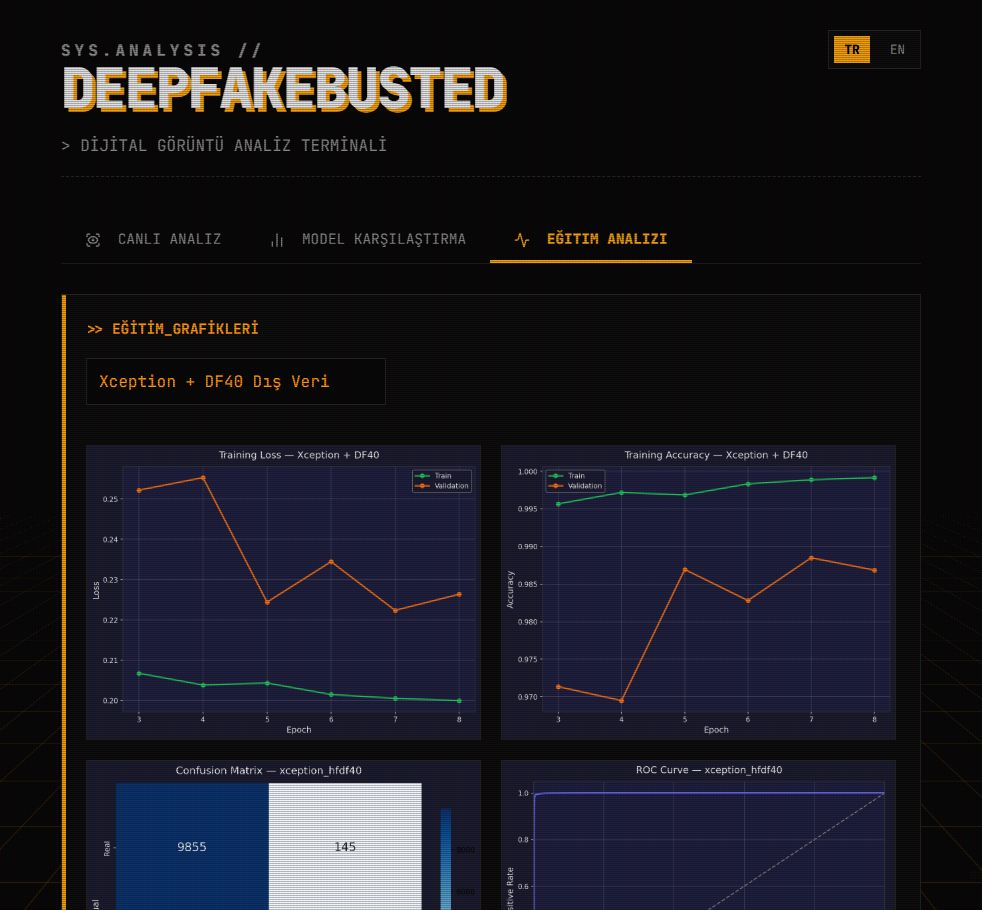
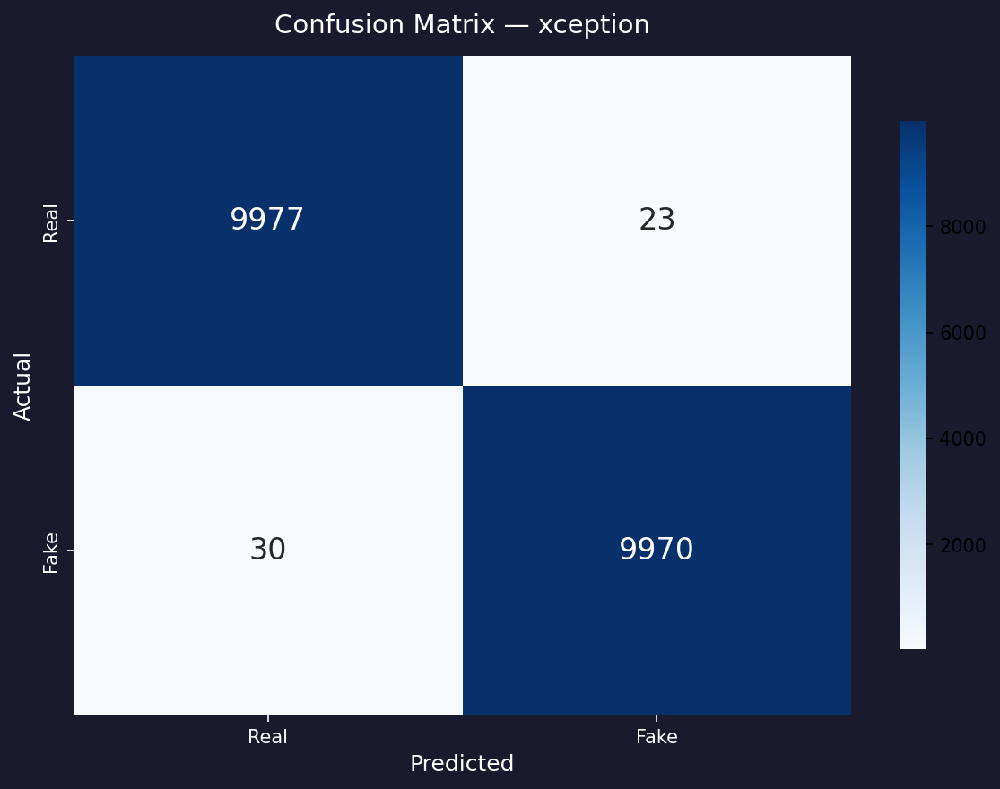
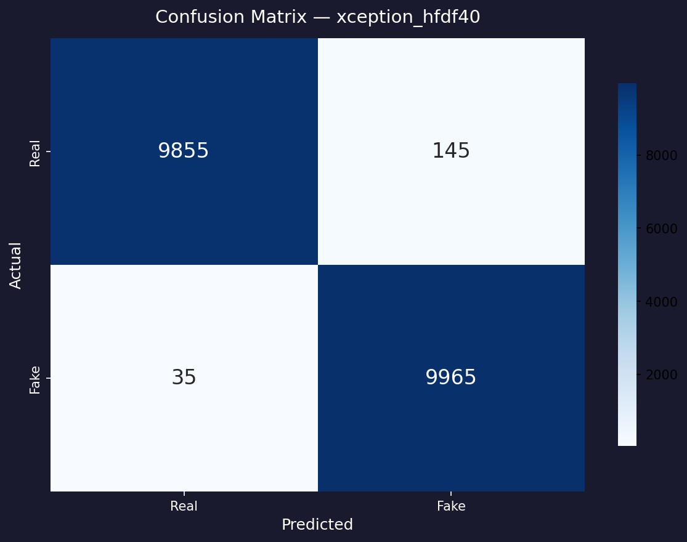
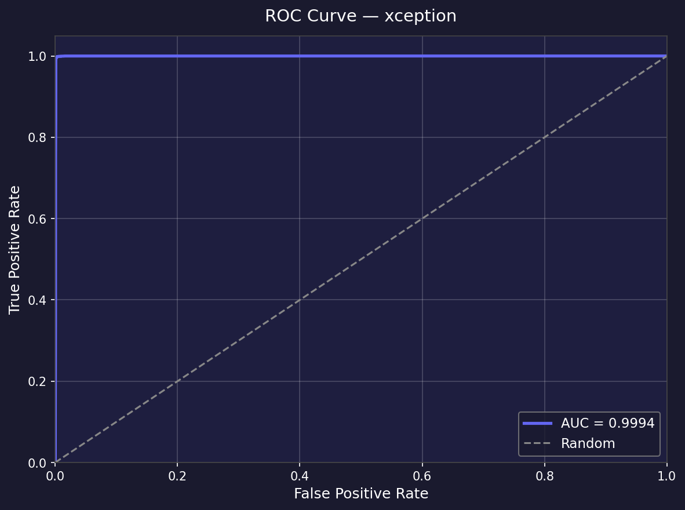
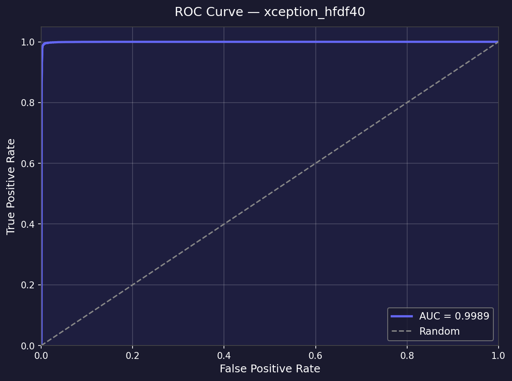
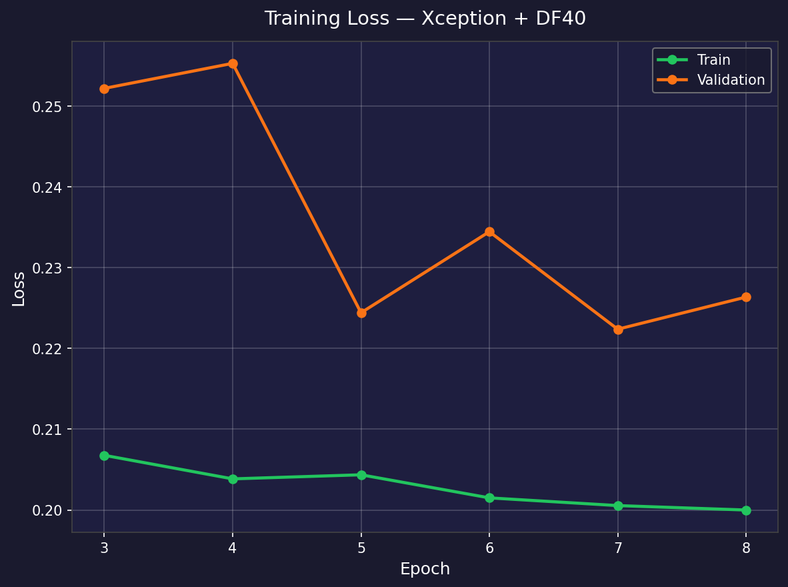

# DeepFakeBusted 🕵️


**DeepFakeBusted** is a deep learning-based deepfake image detection system that compares multiple CNN architectures and improves cross-dataset generalization with an enhanced Xception model.  
**DeepFakeBusted**, farklı CNN mimarilerini karşılaştıran ve geliştirilmiş Xception modeliyle farklı veri kümelerinde genelleme başarımını artıran derin öğrenme tabanlı bir deepfake görüntü tespit sistemidir.

---

## 📄 Akademik Makale / Academic Paper

> **Deepfake Detection and Generalization: A Comparative Study of Deep Learning Architectures**  
> **Deepfake Tespiti ve Genelleme: Derin Öğrenme Mimarilerinin Karşılaştırmalı Analizi**
>
> Ali Eren Tuğrul, Yakup Kutlu  
> Department of Computer Engineering, Iskenderun Technical University, Hatay, Türkiye  
> *Journal of Artificial Intelligence and Computer Vision*, 2026

Bu proje bu makalenin uygulama kaynağıdır. Makale; MesoNet, ResNet-50, EfficientNet-B4, Xception ve Xception+DF40 modellerinin hem kapalı hem açık dağılım senaryolarında karşılaştırmalı analizini içermektedir.

---

## Project at a Glance

| Başlık | Sonuç |
|---|---|
| Karşılaştırılan modeller | MesoNet, ResNet-50, EfficientNet-B4, Xception |
| En yüksek orijinal test başarımı | **Xception — %99.73 accuracy** |
| Dağılım değişimindeki problem | Xception dış testte yalnızca **%52.74 accuracy** ve **%6.04 fake recall** |
| Nihai tercih edilen model | **Xception + DF40 Dış Veri** |
| Nihai dış test başarımı | **%92.15 accuracy**, **0.9828 AUC**, **%84.50 fake recall** |
| Uygulama katmanı | Flask API + React/Vite web arayüzü |

Bu proje, kapalı dağılımdaki yüksek doğruluğun tek başına yeterli olmadığını; gerçek dünyaya daha yakın senaryolarda veri çeşitliliğinin kritik olduğunu gösterir.

---

## 🖥️ Web Arayüzü / Demo

### Canlı Analiz — Görsel Yükleme ve Model Seçimi


### Analiz Sonucu — Deepfake Tespit Çıktısı


### Tüm Modeller Karşılaştırma — Konsensüs Kararı


### Model Karşılaştırma Tablosu


### Eğitim Analizi Sekmesi


Web arayüzü şunları sunar:

- Tek görsel üzerinde canlı deepfake analizi
- Yüz kırpma tabanlı ön işleme (OpenCV Haar Cascade)
- Tüm modellerle karşılaştırmalı tahmin ve konsensüs kararı
- Accuracy, AUC, F1 ve çıkarım süresi tablosu
- Eğitim kaybı / doğruluk eğrileri ve ROC / confusion matrix grafikleri

---

## 📊 Sonuç Grafikleri / Results

### Confusion Matrix — Xception (Ana Test Seti, %99.73)


### Confusion Matrix — Xception+DF40 (Ana Test Seti, %99.10)


### ROC Curve — Xception (AUC = 0.9994)


### ROC Curve — Xception+DF40 Harici Test (AUC = 0.9828)


### Eğitim Kaybı — Xception+DF40


---

## 📈 Performans Tabloları

### Ana Veri Seti (140k Real and Fake Faces)

| Model | Accuracy | AUC-ROC | F1-Score | Model Boyutu |
|---|---:|---:|---:|---:|
| MesoNet | %81.34 | 0.9067 | 0.7930 | 0.09 MB |
| ResNet-50 | %97.31 | 0.9990 | 0.9724 | 89.89 MB |
| EfficientNet-B4 | %99.60 | 0.9999 | 0.9960 | 67.43 MB |
| **Xception** | **%99.73** | **0.9994** | **0.9973** | 79.60 MB |

### Harici Veri Seti (DF40) — Genelleme Testi

| Model | Dış test accuracy | Dış test AUC | Dış test fake recall |
|---|---:|---:|---:|
| Xception | %52.74 | — | %6.04 |
| **Xception + DF40** | **%92.15** | **0.9828** | **%84.50** |

---

## Kullanılan Teknolojiler

- **Python, PyTorch, torchvision, timm**
- **Flask** tabanlı backend API
- **React + Vite** tabanlı frontend
- Eğitim ve değerlendirme için:
  - Accuracy, AUC-ROC, F1-Score, Precision / Recall
  - Inference time
  - Confusion matrix / ROC curve

---

## Proje Yapısı

```text
DeepFakeBusted/
├── colab/                    # Google Colab çalışma defteri
├── models/                   # Model tanımları ve factory
├── preprocessing/            # Yüz kırpma işlemleri
├── training/                 # Eğitim, değerlendirme ve ayarlar
├── scripts/                  # Veri hazırlama ve yardımcı scriptler
├── results/
│   ├── logs/                 # Eğitim logları
│   ├── metrics/              # Ölçüm çıktıları
│   └── plots/                # Grafikler
├── rapor/
│   └── ekran_goruntuleri/    # Web arayüzü ekran görüntüleri
├── web/
│   ├── server.py             # Flask API
│   └── frontend/             # React arayüzü
└── requirements.txt
```

> Not: Veri setleri, sanal ortam dosyaları ve eğitim checkpoint'leri repo boyutunu makul tutmak için GitHub'a eklenmemiştir.

---

## Kurulum

```bash
# 1. Sanal ortam oluştur
python -m venv venv
venv\Scripts\activate

# 2. Bağımlılıkları yükle
pip install -r requirements.txt

# 3. CUDA destekli PyTorch kurulumu
pip install torch torchvision --index-url https://download.pytorch.org/whl/cu121
```

---

## Veri Setleri

### Ana veri seti

**140k Real and Fake Faces**  
https://www.kaggle.com/datasets/xhlulu/140k-real-and-fake-faces

```bash
pip install kaggle
kaggle datasets download -d xhlulu/140k-real-and-fake-faces -p data/raw/ --unzip
python scripts/prepare_data.py --source data/raw/real-vs-fake --dest data/processed
```

### Dış veri seti

Genelleme çalışması için DF40 tabanlı ek dış veri kullanılmıştır. Bu veri, `train / val / test` ayrımıyla ikinci bir veri kökü olarak eğitime dahil edilmiştir.

---

## Eğitim

```bash
# Temel modeller
python -m training.train --model mesonet
python -m training.train --model resnet50
python -m training.train --model efficientnet_b4
python -m training.train --model xception

# Dış veri ile genelleme odaklı Xception eğitimi
python -m training.train --model xception \
  --extra-data-dir path/to/external_dataset \
  --run-name xception_hfdf40
```

Google Colab akışı için hazır notebook:  
`colab/DeepFakeBusted_Pro_Run.ipynb`

---

## Değerlendirme

```bash
# Tek model
python -m training.evaluate --model xception

# Tüm temel modeller
python -m training.evaluate --model all

# Dış veriyle eğitilmiş modeli değerlendirme
python -m training.evaluate --model xception \
  --run-name xception_hfdf40 \
  --extra-data-dir path/to/external_dataset
```

Çıktılar: `results/metrics/` ve `results/plots/`

---

## Web Demo

```bash
# Backend
python web/server.py

# Frontend
cd web/frontend
npm install
npm run dev
```

Frontend varsayılan olarak `http://127.0.0.1:5000/api` adresindeki API'ye bağlanır.

---

## Modeller

| Model | Açıklama |
|---|---|
| **MesoNet** | Deepfake tespiti için hafif CNN (0.09 MB) |
| **ResNet-50** | Güçlü transfer learning baseline |
| **EfficientNet-B4** | Yüksek doğruluk / verimlilik dengesi |
| **Xception** | Projede en yüksek kapalı dağılım başarımı (%99.73) |
| **Xception + DF40 Dış Veri** | Daha güçlü cross-dataset genelleme için nihai model (%92.15 dış test) |

---

## Referanslar

- Deng, J., Lin, C., Hu, P., Shen, C., Wang, Q., Li, Q., & Li, Q. (2024). Towards Benchmarking and Evaluating Deepfake Detection. *IEEE Transactions on Dependable and Secure Computing.* https://doi.org/10.1109/tdsc.2024.3369711
- Dong, S., Wang, J., Ji, R., Liang, J., Fan, H., & Ge, Z. (2023). Implicit Identity Leakage: The Stumbling Block to Improving Deepfake Detection Generalization. *CVPR 2023.* https://doi.org/10.1109/cvpr52729.2023.00389
- Fang, S., Zhang, Z., & Song, B. (2025). Deepfake Detection Model Combining Texture Differences and Frequency Domain Information. *ACM Transactions on Privacy and Security.*
- Gong, L. Y., & Li, X. J. (2024). A Contemporary Survey on Deepfake Detection: Datasets, Algorithms, and Challenges. *Electronics.* https://doi.org/10.3390/electronics13030585
- Huang, P., Han, Y., Chu, E., Chen, J., & Hua, K. (2023). Multi-Task Self-Blended Images for Face Forgery Detection. *ACM Multimedia Asia 2023.* https://doi.org/10.1145/3595916.3626426
- Kingra, S., Aggarwal, N., & Kaur, N. (2025). Assessing deepfake detection methods: a comparative evaluation on novel large-scale Asian deepfake dataset. *International Journal of Data Science and Analytics.*
- Kumar, M., & Verma, B. (2026). Performance Evaluation of Face Forgery Detection Models: A Comparative Study. *Lecture Notes in Networks and Systems.*
- Li, J., Xie, H., Yu, L., Gao, X., & Zhang, Y. (2021). Discriminative Feature Mining Based on Frequency Information and Metric Learning for Face Forgery Detection. *IEEE TKDE.* https://doi.org/10.1109/tkde.2021.3117003
- Luo, A., Cai, R., Kong, C., Ju, Y., Kang, X., & Huang, J. (2024). Forgery-aware Adaptive Learning with Vision Transformer for Generalized Face Forgery Detection. *IEEE TCSVT.* https://doi.org/10.1109/tcsvt.2024.3522091
- Ma, Z., Mei, X., & Shen, J. (2023). 3D Attention Network for Face Forgery Detection. *ICTC 2023.* https://doi.org/10.1109/ictc57116.2023.10154671
- Peng, C., Chen, T., Liu, D., Guo, H., Wang, N., & Gao, X. (2025). Revisiting face forgery detection towards generalization. *Neural Networks.*
- Ramachandran, S., Nadimpalli, A. V., & Rattani, A. (2021). An Experimental Evaluation on Deepfake Detection using Deep Face Recognition. *ICCST 2021.* https://doi.org/10.1109/iccst49569.2021.9717407
- Tian, C., Luo, Z., Shi, G., & Li, S. (2023). Frequency-Aware Attentional Feature Fusion for Deepfake Detection. *ICASSP 2023.* https://doi.org/10.1109/icassp49357.2023.10094654
- Zhuang, W., Chu, Q., Yuan, H., Miao, C., Liu, B., & Yu, N. (2022). Towards Universal Fake Image Detection by Training on an Image Budget. *arXiv preprint.*
